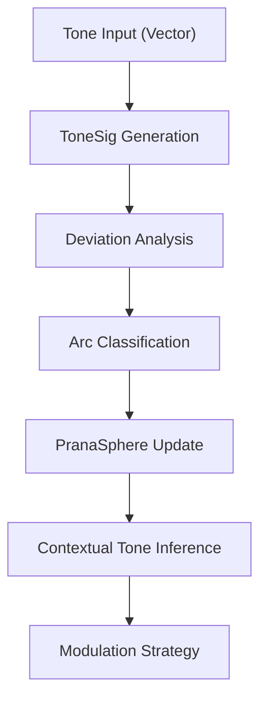

# Spanda Engine™ & PranaSphere™ – by PUTMAN

**Symbolic cognition infrastructure** for emotional AI, narrative engines, and tonal NPCs.  
This Phase 1 release includes the core pipeline from **tone signal detection** to **field resonance** and **contextual modulation**.

# Spanda Engine Pre-Demo

🚀 **Live Demo:** [https://spanda-engine-predemo.vercel.app](https://spanda-engine-predemo.vercel.app)

This is a simplified public preview of the Spanda Engine™ — a system for real-time emotional resonance modeling, symbolic tone parsing, and recursive narrative logic.

The full PUTMAN Suite of Emotive Software will be released in stages.
---

### 📋 Prerequisites

- **Node.js** v16+ (recommended: v18+)
- **npm** v8+

---

### 📥 Installation

```bash
git clone https://github.com/putmanmodel/spanda-pranasphere.git
cd spanda-pranasphere
npm install
```

---

### 🔁 Quickstart – “Hello, Tone”

```bash
npm run liveNuanceTest
# or
npm run test:nuance
```

This simulates the full flow:

- Injects mock tone signals  
- Detects arcs from deviation  
- Tracks resonance in the PranaSphere  
- Runs contextual inference  

---

### 🧩 Core Modules

| Module                       | Description                               | Sample Output               |
|------------------------------|-------------------------------------------|-----------------------------|
| `stackedDeviation.ts`        | Detects arcs from emotional deviation     | `arcType: 'swing'`          |
| `toneArcMemory.ts`           | Tracks tone memory across poles           | `avgDeviation: 0.35`        |
| `contextualToneInference.ts` | Infers alignment between tone + mood      | `resonance: 'aligned'`      |
| `memoryBuffer.ts`            | Temporary buffer for tone snapshots       | _n/a_                       |
| `liveNuanceTest.ts`          | Runs the full Spanda + PranaSphere stack  | Full inference output       |

---

### 🧠 Mermaid Flow – Tone to Modulation



---

### 🛠️ Developer Notes

```bash
npm run lint
npm run typecheck
```

- Cover edge cases: sarcasm flips, zero-deviation, conflicting poles  
- Write unit tests for each module under `src/`  

---

### 🔬 Edge Case Tests

To run symbolic tone engine tests against curated edge case scenarios:

```bash
npm run edge-case -- <case-id>
```

#### Available Test Cases

| ID                        | Description                                                                      |
|--------------------------|-----------------------------------------------------------------------------------|
| `sarcasm-flip`           | High-tone input meant ironically — initial positivity flips to sharp negative.    |
| `flatline-no-deviation`  | Repeated neutral inputs show no emotional swing — stability with zero arc.        |
| `clashing-signals`       | Two poles receive opposing inputs — system must choose dominant or flag conflict. |
| `overamplification-drift`| Rapid tone escalation leads to runaway loop — tests intensity vs decay balance.   |

---

### 📊 Sample Output Results

| Case ID                   | Arc Type | Peak Pole  | Avg Deviation  | Inference Summary                          |
|---------------------------|----------|------------|----------------|--------------------------------------------|
| `sarcasm-flip`            | `surge`  | 1          | -0.20          | Clashing → Redirect; then Neutral → Dampen |
| `flatline-no-deviation`   | `flat`   | 2          | 0.00           | Both aligned → Amplify                     |
| `clashing-signals`        | `swing`  | 4          | -0.03          | Both clashing → Redirect                   |
| `overamplification-drift` | `swing`  | 5          | +1.23          | Dampen → Dampen → Amplify                  |

---

### 🤝 Contributing

1. Fork the repo  
2. Create a feature branch  
3. Add your code + tests  
4. Submit a PR with a clear explanation  

---

### 💬 Troubleshooting

- TS errors after file changes? → Restart the TypeScript server or clear your IDE cache  
- No tone data? → Run `liveNuanceTest` once to seed memory before inference  

---

### 📄 [License](./LICENSE)

Licensed under **CC-BY-NC 4.0**  
Free for research, education, and non-commercial use.  
Commercial licensing available by inquiry.

---

### 📡 Contact

- Email: [putmanmodel@pm.me](mailto:putmanmodel@pm.me)  
- X (Twitter): [@putmanmodel](https://x.com/putmanmodel)  
- LinkedIn: [Stephen A. Putman](https://www.linkedin.com/in/stephen-a-putman-0ba70a36b/)  
- BlueSky: [@putmanmodel.bsky.social](https://bsky.app/profile/putmanmodel.bsky.social)
---

### 🧭 Coming Soon – Visual Layers + Symbolic Mapping

The included `tonePairs.json` and `keywordMap.json` form the symbolic base for future emotional modeling tools.  
These files support upcoming visual and semantic systems currently in active R&D.

### 🌱 Planned Experimental Modules

- 🎨 ToneGlowHUD™ — Real-time emotional field overlays (Unity-ready)  
- 🧠 Nuance Engine — Symbolic tone memory with recursive deviation tracking  
- 📊 ToneSig Scene Designer — Visualize NPC state arcs + resonance clusters  

These features are exploratory and may evolve as the Spanda Engine develops.
---

### 📦 Version

**1.0.0**
